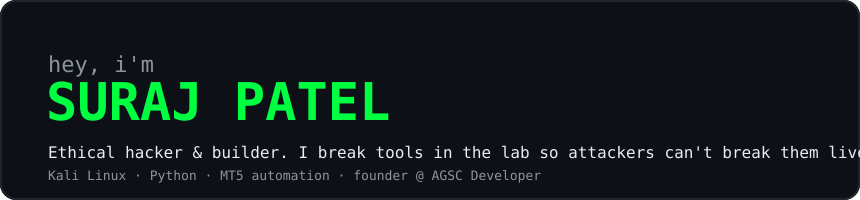
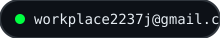
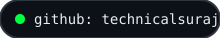
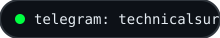
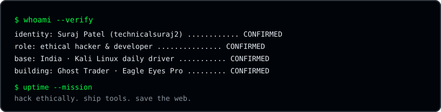
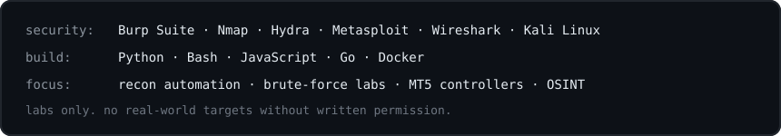

  

  

**[Ghost Trader](https://github.com/technicalsuraj2/ghost-trader)** — MT5 auto-trade terminal with profit-target and max-loss guard. Kali launcher plus Tkinter controller, built for demo-first testing.

**[Eagle Eyes Pro](https://github.com/technicalsuraj2/Eagleeyes)** — device-tracking and monitoring toolkit for Termux and Linux labs.

**[Rootlock](https://github.com/technicalsuraj2/rootlock)** — system hardening and lock utilities. **[DarkDomainFinder](https://github.com/technicalsuraj2/DarkDomainFinder)** — domain recon toolkit. **[WifiBruteforce](https://github.com/technicalsuraj2/wifibruteforce)** — wireless stress-testing for your own labs.

  

I take on small security-automation builds and lab tooling. Legal labs only — no real-world targets without written permission.

  

Found a wrong result in one of my recon tools? Those reports are the most useful — send the command, the target type, and what you expected.

  

  
  
  

  

  

I work the same way on attack surface and on automation: enumerate what is reachable, verify what is real, and delete what only looks like a result. Most recon output fails at the second step, so my tools try to verify before they print.

| | Detail | Status |
|---|---|---|
| **Role** | Ethical hacker · Developer · Founder @ AGSC Developer | `CONFIRMED` |
| **Base** | India · Kali Linux daily driver | `CONFIRMED` |
| **Focus** | Recon automation · MT5 controllers · lab tooling | `CONFIRMED` |
| **Handle** | `technicalsuraj2` — same on GitHub and Telegram | `CONFIRMED` |

  

  

  

| | What it is | Stack |
|---|---|---|
| **[Ghost Trader](https://github.com/technicalsuraj2/ghost-trader)** | MT5 auto-trade controller with profit target and max-loss protection. | `Python` `Tkinter` |
| **[Eagle Eyes Pro](https://github.com/technicalsuraj2/Eagleeyes)** | Device tracking toolkit for Termux and Linux. | `Python` `Bash` |
| **[Subfinder](https://github.com/technicalsuraj2/Subdomain-finder-)** | Hidden subdomain discovery for bug-bounty recon. | `Python` |
| **[DarkDomainFinder](https://github.com/technicalsuraj2/DarkDomainFinder)** | Domain exploration toolkit. | `Python` |
| **[WifiBruteforce](https://github.com/technicalsuraj2/wifibruteforce)** | Wireless stress-testing for owned labs. | `Python` |
| **[Rootlock](https://github.com/technicalsuraj2/rootlock)** | System lock and hardening helper. | `Python` `Bash` |

  

This page uses only files in this repo (<code>./assets/*.svg</code>). No third-party stats trackers — if GitHub's own contribution graph is down, this README still renders.

  

If a tool saved you an evening, star the repo and follow for the next drop.

<code>scan complete · 4 attributes confirmed · 0 inferred</code>

